# Design Document: AI-Based Crop Recommendation System

## Overview

The AI-based Crop Recommendation System is a comprehensive agricultural intelligence platform designed specifically for Indian farmers. The system combines machine learning models, real-time satellite and weather data, IoT sensors, market intelligence, and multilingual voice-enabled interfaces to provide actionable farming insights.

The architecture follows a microservices approach with the following key components:
- **Mobile Application**: React Native app with multilingual voice support
- **Backend Services**: Node.js/Python microservices on AWS
- **AI/ML Services**: Crop recommendation engine, market prediction, climate alerts
- **AI Chatbot**: AWS Bedrock with Claude AI for conversational assistance
- **IoT Gateway**: ESP32-based sensors with LoRaWAN connectivity
- **External Integrations**: Satellite APIs (Sentinel-1/2, ISRO), Weather APIs, AGMARKNET

The system prioritizes accessibility for users with limited technical literacy through voice-first interactions, simple UI flows, and support for 12+ Indian languages.

## Architecture

### High-Level Architecture

The system follows a simplified layered architecture:

```mermaid
%%{init: {'theme':'base', 'themeVariables': { 'fontSize':'25px', 'fontFamily':'arial'}}}%%
graph TB
    subgraph User["<b>👤 USER LAYER</b>"]
        direction TB
        U[" "]
        Mobile["<b>Mobile App</b><br/>(React Native + Voice)"]
        U ~~~ Mobile
    end
    
    subgraph Gateway["<b>🔐 API GATEWAY LAYER</b>"]
        direction TB
        G[" "]
        API["<b>API Gateway</b><br/>+ Authentication"]
        G ~~~ API
    end
    
    subgraph Services["<b>⚙️ APPLICATION SERVICES</b>"]
        direction TB
        S[" "]
        Crop["<b>Crop Recommendation</b><br/>Service"]
        Market["<b>Market Price</b><br/>Service"]
        Climate["<b>Climate Alert</b><br/>Service"]
        IoT["<b>IoT Gateway</b><br/>Service"]
        History["<b>History</b><br/>Service"]
        Translation["<b>Translation</b><br/>Service"]
        S ~~~ Crop
        S ~~~ Market
    end
    
    subgraph AI["<b>🤖 AI/ML LAYER</b>"]
        direction TB
        A[" "]
        ML["<b>ML Models</b><br/>(Crop Prediction)"]
        Bedrock["<b>AWS Bedrock</b><br/>(Claude Chatbot)"]
        Speech["<b>Speech Services</b><br/>(STT/TTS)"]
        A ~~~ ML
        A ~~~ Bedrock
    end
    
    subgraph Data["<b>💾 DATA LAYER</b>"]
        direction TB
        D[" "]
        DB[("<b>PostgreSQL</b><br/>(User & Farm Data)")]
        Cache[("<b>Redis Cache</b>")]
        TS[("<b>TimescaleDB</b><br/>(IoT Sensor Data)")]
        S3["<b>S3 Storage</b><br/>(Images & Models)"]
        D ~~~ DB
        D ~~~ Cache
    end
    
    subgraph External["<b>🌐 EXTERNAL DATA SOURCES</b>"]
        direction TB
        E[" "]
        Satellite["<b>Satellite APIs</b><br/>(Sentinel/ISRO)"]
        Weather["<b>Weather APIs</b><br/>(OpenWeather)"]
        Mandi["<b>AGMARKNET</b><br/>(Mandi Prices)"]
        Sensors["<b>IoT Sensors</b><br/>(LoRaWAN)"]
        E ~~~ Satellite
        E ~~~ Weather
    end
    
    Mobile --> API
    API --> Crop
    API --> Market
    API --> Climate
    API --> IoT
    API --> History
    API --> Bedrock
    
    Crop --> ML
    
    Crop --> DB
    Market --> DB
    Market --> Translation
    Climate --> DB
    IoT --> TS
    History --> DB
    
    Bedrock --> Speech
    Bedrock --> Translation
    
    ML --> Satellite
    ML --> Weather
    Market --> Mandi
    Climate --> Weather
    IoT --> Sensors
    
    Crop -.-> Cache
    Market -.-> Cache
    
    History --> S3
    
    style User fill:#e1f5ff,stroke:#0066cc,stroke-width:4px
    style Gateway fill:#fff4e1,stroke:#ff9900,stroke-width:4px
    style Services fill:#f0e1ff,stroke:#9933ff,stroke-width:4px
    style AI fill:#ffe1f5,stroke:#ff3399,stroke-width:4px
    style Data fill:#e1ffe1,stroke:#00cc66,stroke-width:4px
    style External fill:#ffe1e1,stroke:#ff3333,stroke-width:4px
    
    style U fill:none,stroke:none
    style G fill:none,stroke:none
    style S fill:none,stroke:none
    style A fill:none,stroke:none
    style D fill:none,stroke:none
    style E fill:none,stroke:none

    style External fill:#ffe1e1,stroke:#ff3333,stroke-width:4px
```



**Key Architecture Principles**:

1. **Layered Design**: Each layer has a specific responsibility and communicates only with adjacent layers
2. **Microservices**: Independent services that can scale and deploy separately  
3. **API-First**: All services expose REST APIs through the API Gateway
4. **Data Separation**: Transactional data (PostgreSQL), time-series data (TimescaleDB), cache (Redis), files (S3)
5. **External Integration**: Loose coupling with external services via adapters with fallback mechanisms
6. **Multilingual Support**: Translation service integrated across all user-facing components

### Component Interaction Flow

1. **User Request Flow**:
   - User speaks in local language → STT converts to text
   - Request routed through API Gateway with authentication
   - Service processes request using ML models and external data
   - Response translated to user's language
   - TTS converts text response to speech

2. **IoT Data Flow**:
   - Sensors collect soil data every 30 minutes
   - Data transmitted via LoRaWAN to IoT Gateway
   - Gateway validates and stores in TimescaleDB
   - Real-time alerts generated for critical conditions
   - Data integrated into recommendation engine

3. **Recommendation Flow**:
   - Collect user location, soil data, IoT readings
   - Fetch satellite and weather data for location
   - ML model generates top 3 crop recommendations
   - Market service fetches mandi prices
   - Calculate ROI and profit predictions
   - Return ranked recommendations with explanations

## Components and Interfaces

### 1. Mobile Application (React Native)

**Purpose**: User-facing application with voice-first interface

**Key Features**:
- Multilingual support (12+ Indian languages)
- Voice navigation and input
- Offline mode for basic features
- Low-bandwidth optimization
- Simple 3-step flows

**Interfaces**:
```typescript
interface UserInput {
  language: string;
  location: Coordinates;
  soilData?: SoilData;
  voiceInput?: AudioBlob;
}

interface Coordinates {
  latitude: number;
  longitude: number;
}

interface SoilData {
  pH: number;
  nitrogen: number;
  phosphorus: number;
  potassium: number;
}
```

### 2. Recommendation Service

**Purpose**: Generate top 3 crop recommendations using AI/ML

**Technology**: Python with FastAPI, scikit-learn, TensorFlow

**Interfaces**:
```python
class RecommendationRequest:
    user_id: str
    location: Coordinates
    soil_data: SoilData
    iot_data: Optional[IoTReadings]
    language: str

class CropRecommendation:
    crop_name: str
    local_name: str
    suitability_score: float
    explanation: str
    expected_yield_per_acre: float
    market_price: float
    roi: float
    profit_margin: float
    sustainability_score: float
    water_usage: str
    soil_impact: str

class RecommendationResponse:
    recommendations: List[CropRecommendation]  # Top 3
    satellite_data: SatelliteData
    weather_forecast: WeatherData
    timestamp: datetime
```

**ML Model**:
- Algorithm: Ensemble of Random Forest, Gradient Boosting, Neural Network
- Training Data: Indian agricultural datasets (soil, weather, crop yields)
- Features: pH, NPK, temperature, humidity, rainfall, location, season
- Output: Crop suitability scores for 50+ Indian crops

### 3. Market Price and Profit Prediction Service

**Purpose**: Fetch mandi prices and calculate profit predictions

**Technology**: Node.js with Express

**Interfaces**:
```typescript
interface MarketPriceRequest {
  crops: string[];
  location: Coordinates;
  language: string;
}

interface MarketPrice {
  crop: string;
  market_name: string;
  min_price: number;
  max_price: number;
  modal_price: number;
  date: Date;
  currency: string;
}

interface ProfitPrediction {
  crop: string;
  expected_yield_per_acre: number;
  revenue_per_acre: number;
  cost_breakdown: CostBreakdown;
  profit_per_acre: number;
  roi_percentage: number;
  break_even_months: number;
}

interface CostBreakdown {
  seeds: number;
  fertilizers: number;
  water: number;
  labor: number;
  total: number;
}
```

**External Integration**:
- AGMARKNET API: `https://api.data.gov.in/resource/9ef84268-d588-465a-a308-a864a43d0070`
- Update frequency: Daily
- Fallback: Historical averages from last 30 days

### 4. Climate Alert System

**Purpose**: Monitor weather patterns and generate early warnings

**Technology**: Python with Celery for background tasks

**Interfaces**:
```python
class ClimateAlert:
    alert_id: str
    user_id: str
    alert_type: str  # drought, flood, heatwave, pest
    severity: str  # low, medium, high, critical
    location: Coordinates
    description: str
    preventive_actions: List[str]
    valid_from: datetime
    valid_until: datetime
    created_at: datetime

class AlertMonitoringConfig:
    drought_threshold_days: int = 7
    flood_warning_hours: int = 48
    heatwave_warning_days: int = 3
    pest_risk_factors: List[str]
```

**Alert Logic**:
- Drought: No rainfall forecast for 7+ days + soil moisture < 20%
- Flood: Heavy rainfall forecast (>100mm in 24h) within 48 hours
- Heatwave: Temperature forecast > 40°C for 3+ consecutive days
- Pest: Temperature 25-30°C + humidity > 70% for 5+ days

**Notification Channels**:
- In-app notifications
- SMS via Twilio
- Voice calls for critical alerts

### 5. IoT Gateway Service

**Purpose**: Collect and process data from field sensors

**Technology**: Node.js with MQTT broker

**Hardware**: ESP32 microcontrollers with LoRaWAN modules

**Sensor Types**:
- Capacitive soil moisture sensor
- DS18B20 waterproof temperature sensor
- NPK sensor (RS485 Modbus)

**Interfaces**:
```typescript
interface IoTSensorReading {
  sensor_id: string;
  farm_id: string;
  location: Coordinates;
  timestamp: Date;
  soil_moisture: number;  // 0-100%
  soil_temperature: number;  // Celsius
  nitrogen: number;  // mg/kg
  phosphorus: number;  // mg/kg
  potassium: number;  // mg/kg
  battery_level: number;  // 0-100%
}

interface IoTAlert {
  sensor_id: string;
  alert_type: string;
  message: string;
  threshold_value: number;
  current_value: number;
  timestamp: Date;
}
```

**Communication Protocol**:
- LoRaWAN for long-range, low-power transmission
- Data transmission every 30 minutes
- Battery life: 6-12 months
- Range: Up to 10km in rural areas

### 6. AI Chatbot Service (AWS Bedrock)

**Purpose**: 24/7 conversational AI assistant for farming queries

**Technology**: AWS Bedrock with Claude 3 Sonnet

**Interfaces**:
```typescript
interface ChatRequest {
  user_id: string;
  session_id: string;
  message: string;
  language: string;
  voice_input?: AudioBlob;
  context: UserContext;
}

interface UserContext {
  location: Coordinates;
  current_crops: string[];
  soil_data: SoilData;
  recent_recommendations: CropRecommendation[];
  farm_size: number;
}

interface ChatResponse {
  message: string;
  voice_output?: AudioBlob;
  suggested_actions: string[];
  related_topics: string[];
  confidence: number;
}
```

**Capabilities**:
- Multilingual RAG (Retrieval Augmented Generation) using Cohere embeddings
- Voice input/output in 12+ Indian languages
- Context-aware responses based on user's farm data
- Learning from local farming practices
- Escalation to human experts for complex queries

**Knowledge Base**:
- Indian crop cultivation practices
- Soil management techniques
- Pest and disease identification
- Weather interpretation
- Market trends and pricing
- Government schemes and subsidies

### 7. Translation Service

**Purpose**: Translate all content to user's selected language

**Technology**: AWS Translate + Custom glossaries for agricultural terms

**Supported Languages**:
- Hindi, English, Tamil, Telugu, Marathi, Bengali
- Gujarati, Kannada, Malayalam, Punjabi, Odia, Assamese

**Interfaces**:
```typescript
interface TranslationRequest {
  text: string;
  source_language: string;
  target_language: string;
  domain: string;  // agriculture, general
}

interface TranslationResponse {
  translated_text: string;
  confidence: number;
}
```

**Custom Glossary**:
- Crop names in all languages
- Agricultural terminology
- Local farming terms
- Measurement units

### 8. Speech Services (STT/TTS)

**Purpose**: Convert between speech and text for voice interface

**Technology**:
- STT: AWS Transcribe with Indian language support
- TTS: AWS Polly with neural voices

**Supported Features**:
- Real-time streaming transcription
- Dialect recognition
- Natural-sounding neural voices
- Adjustable speech rate for clarity

**Interfaces**:
```typescript
interface STTRequest {
  audio: AudioBlob;
  language: string;
  sample_rate: number;
}

interface STTResponse {
  text: string;
  confidence: number;
  language_detected: string;
}

interface TTSRequest {
  text: string;
  language: string;
  voice_id: string;
  speech_rate: number;  // 0.5 to 2.0
}

interface TTSResponse {
  audio: AudioBlob;
  duration_ms: number;
}
```

## Data Models

### User Model
```typescript
interface User {
  user_id: string;
  phone_number: string;
  name: string;
  preferred_language: string;
  location: Coordinates;
  farm_size_acres: number;
  created_at: Date;
  last_login: Date;
}
```

### Farm Model
```typescript
interface Farm {
  farm_id: string;
  user_id: string;
  name: string;
  location: Coordinates;
  area_acres: number;
  soil_type: string;
  current_crops: string[];
  iot_sensors: string[];
  created_at: Date;
}
```

### Recommendation History Model
```typescript
interface RecommendationHistory {
  history_id: string;
  user_id: string;
  farm_id: string;
  timestamp: Date;
  recommendations: CropRecommendation[];
  soil_data: SoilData;
  weather_data: WeatherData;
  satellite_data: SatelliteData;
  user_selected_crop: string;
  actual_yield: number;  // Updated after harvest
}
```

### IoT Sensor Model
```typescript
interface IoTSensor {
  sensor_id: string;
  farm_id: string;
  sensor_type: string;
  location: Coordinates;
  installation_date: Date;
  last_reading: Date;
  battery_level: number;
  status: string;  // active, inactive, maintenance
}
```

### Climate Alert Model
```typescript
interface ClimateAlertRecord {
  alert_id: string;
  user_id: string;
  farm_id: string;
  alert_type: string;
  severity: string;
  description: string;
  preventive_actions: string[];
  created_at: Date;
  valid_until: Date;
  acknowledged: boolean;
  acknowledged_at: Date;
}
```

### Chat Session Model
```typescript
interface ChatSession {
  session_id: string;
  user_id: string;
  started_at: Date;
  last_message_at: Date;
  message_count: number;
  language: string;
  context: UserContext;
}

interface ChatMessage {
  message_id: string;
  session_id: string;
  role: string;  // user, assistant
  content: string;
  timestamp: Date;
  voice_input: boolean;
}
```

## External API Integrations

### 1. Satellite Data APIs

**Sentinel-1/2 (ESA Copernicus)**:
- Purpose: Soil moisture, vegetation indices (NDVI, EVI)
- Access: Free via Copernicus Open Access Hub
- Resolution: 10-20 meters
- Update frequency: 5-6 days

**ISRO EOS-04 (RISAT-1A)**:
- Purpose: High-resolution soil moisture (500m resolution)
- Access: ISRO Bhuvan API
- Update frequency: Weekly
- Coverage: India-specific

**Implementation**:
```python
class SatelliteDataService:
    def fetch_soil_moisture(self, location: Coordinates, date: datetime) -> float:
        # Fetch from Sentinel-1 SAR data
        pass
    
    def fetch_vegetation_index(self, location: Coordinates) -> float:
        # Calculate NDVI from Sentinel-2 optical data
        pass
```

### 2. Weather APIs

**OpenWeatherMap API**:
- Purpose: Current weather and 7-day forecast
- Features: Temperature, humidity, rainfall, wind
- Update frequency: Hourly
- Cost: Free tier (1000 calls/day)

**Implementation**:
```python
class WeatherService:
    def get_current_weather(self, location: Coordinates) -> WeatherData:
        pass
    
    def get_forecast(self, location: Coordinates, days: int) -> List[WeatherData]:
        pass
```

### 3. AGMARKNET API

**Purpose**: Daily mandi prices for agricultural commodities

**Endpoint**: `https://api.data.gov.in/resource/9ef84268-d588-465a-a308-a864a43d0070`

**Parameters**:
- api-key: Government API key
- format: json
- filters[commodity]: Crop name
- filters[state]: State name
- filters[district]: District name

**Implementation**:
```typescript
class MandiPriceService {
  async fetchPrice(crop: string, location: Coordinates): Promise<MarketPrice> {
    // Fetch from AGMARKNET
    // Fallback to historical average if unavailable
  }
  
  async fetchHistoricalPrices(crop: string, days: number): Promise<MarketPrice[]> {
    // Fetch historical data for trend analysis
  }
}
```

## Correctness Properties

*A property is a characteristic or behavior that should hold true across all valid executions of a system—essentially, a formal statement about what the system should do. Properties serve as the bridge between human-readable specifications and machine-verifiable correctness guarantees.*

Before defining the correctness properties, I need to analyze which acceptance criteria are testable as properties:


### Property 1: Recommendation Count and Ranking
*For any* valid soil and environmental data input, the recommendation engine should return exactly 3 crop recommendations, and they should be ranked in descending order by suitability score.
**Validates: Requirements 1.1**

### Property 2: Recommendation Completeness
*For any* crop recommendation, it should include all required fields: crop name, suitability score, expected yield per acre, market price, ROI, profit margin, sustainability indicators (water usage and soil impact), and cost breakdown with all components (seeds, fertilizers, water, labor).
**Validates: Requirements 1.6, 3.2, 3.3, 3.4, 3.5, 3.8**

### Property 3: Language Consistency
*For any* user interface content when a language is selected, all text elements (crop names, instructions, results, error messages) should be in that selected language.
**Validates: Requirements 1.3, 7.7**

### Property 4: External Data Integration
*For any* valid farm coordinates, the system should successfully fetch both weather data and satellite data, and these should be integrated into the crop recommendation response.
**Validates: Requirements 2.1, 2.2, 2.6**

### Property 5: Cached Data Fallback
*For any* external API failure (weather, satellite, or mandi prices), the system should return cached data and include a staleness indicator or notification flag in the response.
**Validates: Requirements 2.5, 3.7, 12.2**

### Property 6: Market Price Completeness
*For any* set of recommended crops, mandi prices should be fetched and included for all of them.
**Validates: Requirements 3.1**

### Property 7: IoT Sensor Reading Completeness
*For any* IoT sensor reading, it should include all required measurements: soil moisture, soil temperature, nitrogen, phosphorus, and potassium levels.
**Validates: Requirements 4.2**

### Property 8: Sensor Data Validation and Storage
*For any* IoT sensor data received, if it passes validation, it should be stored in the database; if it fails validation or appears anomalous, it should be flagged and not used in recommendations.
**Validates: Requirements 4.3, 7.8**

### Property 9: Critical Condition Alerts
*For any* IoT sensor reading with critical values (soil moisture < 20%, temperature > 45°C, or nutrient levels critically low), an alert should be generated.
**Validates: Requirements 4.5**

### Property 10: Sensor Failure Notification
*For any* sensor that has not reported data for more than 2 hours (4 missed readings), a notification should be generated for the user and administrator.
**Validates: Requirements 4.7**

### Property 11: Climate Alert Generation
*For any* weather forecast data that indicates risk conditions (no rainfall for 7+ days, heavy rainfall >100mm in 24h, temperature >40°C for 3+ days, or pest-favorable conditions), a corresponding climate alert should be generated with appropriate preventive actions.
**Validates: Requirements 5.1, 5.2, 5.3, 5.4, 5.6**

### Property 12: Alert History Persistence
*For any* generated climate alert or completed recommendation, it should be stored in the user's history with all relevant data.
**Validates: Requirements 5.8, 9.1, 9.2**

### Property 13: Chatbot Language Consistency
*For any* voice or text query to the AI chatbot in a supported language, the response should be in the same language as the query.
**Validates: Requirements 6.5**

### Property 14: Chatbot Context Preservation
*For any* conversation session, subsequent messages should have access to previous messages in the conversation context.
**Validates: Requirements 6.12**

### Property 15: Chatbot Escalation
*For any* chatbot response with confidence below 70%, the system should escalate to human experts and notify the user of the escalation.
**Validates: Requirements 6.13**

### Property 16: Input Validation Rules
*For any* input data, the following validation rules should be enforced: pH between 0-14, nutrient values non-negative, temperature between -10°C and 55°C, humidity between 0-100%, soil moisture between 0-100%, and coordinates within Indian geographical boundaries (latitude 8-37°N, longitude 68-97°E). Invalid inputs should be rejected with specific error messages.
**Validates: Requirements 7.1, 7.2, 7.3, 7.4, 7.5, 7.6, 7.7**

### Property 17: History Chronological Ordering
*For any* user history query, the results should be sorted in reverse chronological order (newest first).
**Validates: Requirements 9.3**

### Property 18: History Filtering
*For any* history filter criteria (date range, crop type, alert type), only records matching all specified criteria should be returned.
**Validates: Requirements 9.4**

### Property 19: CSV Export Validity
*For any* history data export, the generated CSV should be valid (proper headers, escaped fields, parseable) and contain all the data from the history query.
**Validates: Requirements 9.5**

### Property 20: Yield Comparison
*For any* harvest data entry with a corresponding prediction, the system should calculate and store the comparison (actual vs predicted yield and percentage difference).
**Validates: Requirements 9.7**

### Property 21: Error Handling Completeness
*For any* system error in recommendation engine, disease detector, or other services, both a user-friendly error message in the selected language and technical log details should be generated.
**Validates: Requirements 12.1**

### Property 22: Graceful Degradation
*For any* IoT sensor connectivity loss, the system should continue operating using other available data sources (satellite, weather, manual input) and generate an alert about the missing sensor data.
**Validates: Requirements 12.3**

### Property 23: API Retry Logic
*For any* transient API failure (5xx errors, timeouts), the system should automatically retry up to 3 times with exponential backoff before falling back to cached data.
**Validates: Requirements 12.6**

### Property 24: Chatbot Fallback
*For any* AWS Bedrock service unavailability, the system should provide basic FAQ responses from a local knowledge base as fallback.
**Validates: Requirements 12.7**

## Error Handling

### Error Categories

1. **Validation Errors** (4xx):
   - Invalid input data (out of range values)
   - Missing required fields
   - Invalid coordinates
   - Unsupported language
   - Response: Specific error message in user's language

2. **External Service Errors** (5xx):
   - Weather API unavailable
   - Satellite API unavailable
   - AGMARKNET unavailable
   - AWS Bedrock unavailable
   - Response: Use cached data, notify user of staleness

3. **IoT Sensor Errors**:
   - Sensor offline
   - Anomalous readings
   - Battery low
   - Response: Alert user, continue with other data sources

4. **System Errors**:
   - Database connection failure
   - ML model loading failure
   - Internal server error
   - Response: User-friendly message, technical logs, admin alert

### Error Response Format

```typescript
interface ErrorResponse {
  error: {
    code: string;
    message: string;  // User-friendly, in selected language
    details?: string;  // Technical details for debugging
    timestamp: Date;
    request_id: string;
  };
  fallback_data?: any;  // Cached data if available
  staleness_indicator?: {
    last_updated: Date;
    age_hours: number;
  };
}
```

### Retry Strategy

- Transient failures: 3 retries with exponential backoff (1s, 2s, 4s)
- Circuit breaker: Open after 5 consecutive failures, half-open after 60s
- Timeout: 10s for external APIs, 30s for ML inference
- Fallback: Cached data (max age: 24 hours for weather, 7 days for satellite)

### Logging Strategy

- All errors logged to CloudWatch with structured logging
- Error severity levels: DEBUG, INFO, WARNING, ERROR, CRITICAL
- Include: timestamp, user_id, request_id, error_code, stack_trace
- PII redaction: Phone numbers, names, exact coordinates
- Retention: 90 days for ERROR, 30 days for WARNING

## Testing Strategy

### Dual Testing Approach

The system will use both unit testing and property-based testing to ensure comprehensive coverage:

**Unit Tests**: Focus on specific examples, edge cases, and integration points
- Example: Test recommendation with specific soil values (pH=6.5, N=50, P=30, K=40)
- Example: Test drought alert with 10 days of no rainfall forecast
- Example: Test CSV export with sample history data
- Edge cases: Empty history, single sensor reading, API timeout
- Integration: Database connections, external API mocking

**Property-Based Tests**: Verify universal properties across all inputs
- Generate random soil data, coordinates, sensor readings
- Verify properties hold for all generated inputs
- Catch edge cases that manual testing might miss
- Each property test runs minimum 100 iterations

### Property-Based Testing Configuration

**Framework**: 
- Python services: Hypothesis
- Node.js services: fast-check

**Configuration**:
```python
# Python example with Hypothesis
from hypothesis import given, settings
import hypothesis.strategies as st

@settings(max_examples=100)
@given(
    ph=st.floats(min_value=0, max_value=14),
    nitrogen=st.floats(min_value=0, max_value=200),
    phosphorus=st.floats(min_value=0, max_value=200),
    potassium=st.floats(min_value=0, max_value=200),
    temperature=st.floats(min_value=-10, max_value=55),
    humidity=st.floats(min_value=0, max_value=100)
)
def test_recommendation_count_and_ranking(ph, nitrogen, phosphorus, potassium, temperature, humidity):
    """
    Feature: crop-recommendation-system, Property 1: Recommendation Count and Ranking
    """
    soil_data = SoilData(ph, nitrogen, phosphorus, potassium, temperature, humidity)
    recommendations = recommendation_engine.get_recommendations(soil_data)
    
    assert len(recommendations) == 3
    assert recommendations[0].suitability_score >= recommendations[1].suitability_score
    assert recommendations[1].suitability_score >= recommendations[2].suitability_score
```

```typescript
// TypeScript example with fast-check
import fc from 'fast-check';

describe('Feature: crop-recommendation-system, Property 16: Input Validation Rules', () => {
  it('should reject invalid pH values', () => {
    fc.assert(
      fc.property(
        fc.oneof(
          fc.float({ max: -0.1 }),
          fc.float({ min: 14.1 })
        ),
        (invalidPH) => {
          const result = validateSoilData({ pH: invalidPH });
          expect(result.valid).toBe(false);
          expect(result.error).toContain('pH');
        }
      ),
      { numRuns: 100 }
    );
  });
});
```

### Test Coverage Goals

- Unit test coverage: 80% minimum
- Property test coverage: All 24 correctness properties
- Integration test coverage: All external API integrations
- E2E test coverage: Critical user flows (recommendation, alerts, chatbot)

### Testing Environments

- **Local**: Docker Compose with mocked external services
- **Staging**: AWS environment with test data
- **Production**: Canary deployments with 5% traffic

### Performance Testing

- Load testing: 1000 concurrent users
- Stress testing: 5000 concurrent users
- Recommendation latency: < 5 seconds (p95)
- Chatbot response: < 3 seconds (p95)
- IoT data ingestion: 10,000 readings/minute

## Deployment Architecture

### Infrastructure

- **Cloud Provider**: AWS
- **Compute**: ECS Fargate for microservices
- **Database**: RDS PostgreSQL (Multi-AZ)
- **Time-Series**: TimescaleDB for IoT data
- **Cache**: ElastiCache Redis
- **Storage**: S3 for images, models, exports
- **CDN**: CloudFront for static assets
- **API Gateway**: AWS API Gateway with WAF

### Scalability

- Auto-scaling: CPU > 70% or Memory > 80%
- Min instances: 2 per service
- Max instances: 20 per service
- Database: Read replicas for query load
- Cache: Redis cluster with 3 nodes

### Monitoring

- **Metrics**: CloudWatch for system metrics
- **Logs**: CloudWatch Logs with structured logging
- **Tracing**: AWS X-Ray for distributed tracing
- **Alerts**: SNS for critical alerts
- **Dashboard**: Grafana for visualization

### Security

- **Authentication**: JWT tokens with phone OTP
- **Authorization**: Role-based access control (RBAC)
- **Encryption**: TLS 1.3 in transit, AES-256 at rest
- **Secrets**: AWS Secrets Manager
- **Network**: VPC with private subnets
- **WAF**: Rate limiting, SQL injection protection

## Future Enhancements

1. **Offline-First Mobile App**: Full offline capability with sync
2. **Drone Integration**: Aerial imagery for crop health monitoring
3. **Blockchain**: Transparent supply chain tracking
4. **Community Features**: Farmer forums and knowledge sharing
5. **Government Integration**: Direct subsidy applications
6. **Insurance Integration**: Automated crop insurance claims
7. **Equipment Marketplace**: Buy/sell/rent farm equipment
8. **Precision Irrigation**: Automated irrigation control based on soil moisture
