# 🎨 Design Document: AI-Based Crop Recommendation System

<div align="center">

**Technical Architecture & Implementation Guide**

*Microservices-based agricultural intelligence platform for Indian farmers*

</div>

---

## 📋 Table of Contents

- [Overview](#-overview)
- [Architecture](#-architecture)
- [Core Components](#-core-components)
- [Data Models](#-data-models)
- [External Integrations](#-external-integrations)
- [Testing Strategy](#-testing-strategy)
- [Deployment](#-deployment)

---

## 🎯 Overview

### System Purpose

An AI-powered platform combining machine learning, real-time data, IoT sensors, and multilingual interfaces to help Indian farmers make data-driven crop decisions.

### Technology Stack

| Layer | Technology |
|-------|-----------|
| 📱 **Mobile** | React Native + Voice UI |
| ⚙️ **Backend** | Node.js, Python (FastAPI) |
| 🤖 **AI/ML** | TensorFlow, scikit-learn, AWS Bedrock (Claude) |
| 💾 **Database** | PostgreSQL, TimescaleDB, Redis |
| ☁️ **Cloud** | AWS (ECS, S3, Lambda, API Gateway) |
| 📡 **IoT** | ESP32 + LoRaWAN |

### Key Features

<table>
<tr>
<td>🌐 <b>12+ Languages</b><br/>Voice-first interface</td>
<td>🛰️ <b>Real-Time Data</b><br/>Satellite & weather</td>
<td>💰 <b>Market Intel</b><br/>Mandi prices & ROI</td>
<td>📡 <b>IoT Sensors</b><br/>Soil monitoring</td>
</tr>
<tr>
<td>⚠️ <b>Climate Alerts</b><br/>Early warnings</td>
<td>🤖 <b>AI Chatbot</b><br/>24/7 voice support</td>
<td>📊 <b>History Tracking</b><br/>Trends & insights</td>
<td>🌍 <b>Translation</b><br/>Real-time multilingual</td>
</tr>
</table>

---

## 🏗️ Architecture

### High-Level Architecture

```mermaid
%%{init: {'theme':'base', 'themeVariables': { 'fontSize':'22px', 'fontFamily':'arial'}}}%%
graph TB
    subgraph User["<b>👤 USER LAYER</b>"]
        direction TB
        U[" "]
        Mobile["<b>Mobile App</b><br/>(React Native + Voice)"]
        U ~~~ Mobile
    end
    
    subgraph Gateway["<b>🔐 API GATEWAY LAYER</b>"]
        direction TB
        G[" "]
        API["<b>API Gateway</b><br/>+ Authentication"]
        G ~~~ API
    end
    
    subgraph Services["<b>⚙️ APPLICATION SERVICES</b>"]
        direction TB
        S[" "]
        Crop["<b>Crop Recommendation</b><br/>Service"]
        Market["<b>Market Price</b><br/>Service"]
        Climate["<b>Climate Alert</b><br/>Service"]
        IoT["<b>IoT Gateway</b><br/>Service"]
        History["<b>History</b><br/>Service"]
        Translation["<b>Translation</b><br/>Service"]
        S ~~~ Crop
        S ~~~ Market
    end
    
    subgraph AI["<b>🤖 AI/ML LAYER</b>"]
        direction TB
        A[" "]
        ML["<b>ML Models</b><br/>(Crop Prediction)"]
        Bedrock["<b>AWS Bedrock</b><br/>(Claude Chatbot)"]
        Speech["<b>Speech Services</b><br/>(STT/TTS)"]
        A ~~~ ML
        A ~~~ Bedrock
    end
    
    subgraph Data["<b>💾 DATA LAYER</b>"]
        direction TB
        D[" "]
        DB[("<b>PostgreSQL</b><br/>(User & Farm Data)")]
        Cache[("<b>Redis Cache</b>")]
        TS[("<b>TimescaleDB</b><br/>(IoT Sensor Data)")]
        S3["<b>S3 Storage</b><br/>(Images & Models)"]
        D ~~~ DB
        D ~~~ Cache
    end
    
    subgraph External["<b>🌐 EXTERNAL DATA SOURCES</b>"]
        direction TB
        E[" "]
        Satellite["<b>Satellite APIs</b><br/>(Sentinel/ISRO)"]
        Weather["<b>Weather APIs</b><br/>(OpenWeather)"]
        Mandi["<b>AGMARKNET</b><br/>(Mandi Prices)"]
        Sensors["<b>IoT Sensors</b><br/>(LoRaWAN)"]
        E ~~~ Satellite
        E ~~~ Weather
    end
    
    Mobile --> API
    API --> Crop
    API --> Market
    API --> Climate
    API --> IoT
    API --> History
    API --> Bedrock
    
    Crop --> ML
    Crop --> Translation
    Crop --> DB
    Market --> DB
    Market --> Translation
    Climate --> DB
    IoT --> TS
    History --> DB
    
    Bedrock --> Speech
    Bedrock --> Translation
    
    ML --> Satellite
    ML --> Weather
    Market --> Mandi
    Climate --> Weather
    IoT --> Sensors
    
    Crop -.-> Cache
    Market -.-> Cache
    
    History --> S3
    
    style User fill:#e1f5ff,stroke:#0066cc,stroke-width:4px
    style Gateway fill:#fff4e1,stroke:#ff9900,stroke-width:4px
    style Services fill:#f0e1ff,stroke:#9933ff,stroke-width:4px
    style AI fill:#ffe1f5,stroke:#ff3399,stroke-width:4px
    style Data fill:#e1ffe1,stroke:#00cc66,stroke-width:4px
    style External fill:#ffe1e1,stroke:#ff3333,stroke-width:4px
    
    style U fill:none,stroke:none
    style G fill:none,stroke:none
    style S fill:none,stroke:none
    style A fill:none,stroke:none
    style D fill:none,stroke:none
    style E fill:none,stroke:none
```



### Architecture Principles

| Principle | Description |
|-----------|-------------|
| 🏢 **Layered Design** | Clear separation of concerns across layers |
| 🔧 **Microservices** | Independent, scalable services |
| 🔌 **API-First** | All services expose REST APIs |
| 💾 **Data Separation** | Transactional (PostgreSQL), time-series (TimescaleDB), cache (Redis) |
| 🌐 **Loose Coupling** | External services via adapters with fallbacks |

### Data Flow Patterns

```
🗣️ User Voice Input → 🎤 STT → 🔐 API Gateway → ⚙️ Service → 🤖 ML Model → 💾 Database → 🌐 Translation → 🔊 TTS → 📱 User
```

---

## 🔧 Core Components

### 1. 📱 Mobile Application

**Tech**: React Native

**Features**:
- Voice-first navigation
- 12+ Indian languages
- Offline mode
- Low-bandwidth optimized

**Key Interfaces**:
```typescript
interface UserInput {
  language: string;
  location: Coordinates;
  soilData?: SoilData;
  voiceInput?: AudioBlob;
}
```

---

### 2. 🌾 Crop Recommendation Service

**Tech**: Python + FastAPI + TensorFlow

**ML Model**:
- Ensemble: Random Forest + Gradient Boosting + Neural Network
- Training: Indian agricultural datasets
- Features: pH, NPK, temperature, humidity, rainfall, location
- Output: Top 3 crops with suitability scores

**API Response**:
```python
class CropRecommendation:
    crop_name: str
    suitability_score: float
    expected_yield_per_acre: float
    market_price: float
    roi: float
    profit_margin: float
    sustainability_score: float
```

---

### 3. 💰 Market Price Service

**Tech**: Node.js + Express

**Data Source**: AGMARKNET API
- Update frequency: Daily
- Fallback: 30-day historical average

**Features**:
- Real-time mandi prices
- ROI calculation
- Cost breakdown (seeds, fertilizers, water, labor)
- Profit predictions

---

### 4. ⚠️ Climate Alert System

**Tech**: Python + Celery

**Alert Types**:

| Alert | Trigger | Advance Notice |
|-------|---------|----------------|
| 🏜️ **Drought** | No rain 7+ days + moisture < 20% | 7 days |
| 🌊 **Flood** | Heavy rain >100mm/24h | 48 hours |
| 🔥 **Heatwave** | Temp >40°C for 3+ days | 3 days |
| 🐛 **Pest Risk** | Temp 25-30°C + humidity >70% | 5 days |

**Notification Channels**: App, SMS, Voice calls

---

### 5. 📡 IoT Gateway Service

**Tech**: Node.js + MQTT

**Hardware**: ESP32 + LoRaWAN

**Sensors**:
- Soil moisture (capacitive)
- Temperature (DS18B20)
- NPK levels (RS485 Modbus)

**Specs**:
- Data transmission: Every 30 minutes
- Battery life: 6-12 months
- Range: Up to 10km

```typescript
interface IoTSensorReading {
  sensor_id: string;
  soil_moisture: number;  // 0-100%
  soil_temperature: number;  // Celsius
  nitrogen: number;  // mg/kg
  phosphorus: number;  // mg/kg
  potassium: number;  // mg/kg
  battery_level: number;  // 0-100%
}
```

---

### 6. 🤖 AI Chatbot Service

**Tech**: AWS Bedrock (Claude 3 Sonnet)

**Capabilities**:
- 24/7 availability
- Voice + text input
- 12+ Indian languages
- Context-aware responses
- RAG with Cohere embeddings

**Knowledge Base**:
- Crop cultivation practices
- Soil management
- Pest/disease identification
- Weather interpretation
- Market trends
- Government schemes

---

### 7. 🌐 Translation Service

**Tech**: AWS Translate + Custom glossaries

**Languages**: Hindi, English, Tamil, Telugu, Marathi, Bengali, Gujarati, Kannada, Malayalam, Punjabi, Odia, Assamese

**Custom Glossary**: Agricultural terms, crop names, local farming terminology

---

### 8. 🎤 Speech Services

**Tech**:
- STT: AWS Transcribe
- TTS: AWS Polly (neural voices)

**Features**:
- Real-time transcription
- Dialect recognition
- Natural-sounding voices
- Adjustable speech rate

---

## 💾 Data Models

### Core Models

```typescript
// User
interface User {
  user_id: string;
  phone_number: string;
  preferred_language: string;
  location: Coordinates;
  farm_size_acres: number;
}

// Farm
interface Farm {
  farm_id: string;
  user_id: string;
  location: Coordinates;
  area_acres: number;
  soil_type: string;
  current_crops: string[];
  iot_sensors: string[];
}

// Recommendation History
interface RecommendationHistory {
  history_id: string;
  user_id: string;
  timestamp: Date;
  recommendations: CropRecommendation[];
  soil_data: SoilData;
  weather_data: WeatherData;
  user_selected_crop: string;
  actual_yield: number;
}

// Climate Alert
interface ClimateAlertRecord {
  alert_id: string;
  user_id: string;
  alert_type: string;  // drought, flood, heatwave, pest
  severity: string;  // low, medium, high, critical
  description: string;
  preventive_actions: string[];
  valid_until: Date;
}
```

---

## 🌐 External Integrations

### 1. 🛰️ Satellite APIs

| API | Purpose | Resolution | Update Frequency |
|-----|---------|------------|------------------|
| **Sentinel-1/2** | Soil moisture, NDVI | 10-20m | 5-6 days |
| **ISRO EOS-04** | High-res soil moisture | 500m | Weekly |

**Access**: Free via Copernicus Open Access Hub, ISRO Bhuvan API

---

### 2. 🌤️ Weather API

**Provider**: OpenWeatherMap

**Features**:
- Current weather
- 7-day forecast
- Temperature, humidity, rainfall, wind
- Update: Hourly
- Cost: Free tier (1000 calls/day)

---

### 3. 💰 AGMARKNET API

**Purpose**: Daily mandi prices

**Endpoint**: `https://agmarknet.gov.in/` (Requires API key registration)

**Authentication**: API key required (register at data.gov.in)

**Parameters**: commodity, state, district, date

**Note**: Alternative sources include state agricultural marketing boards or private aggregators

---

## ✅ Testing Strategy

### Dual Approach

| Test Type | Purpose | Coverage |
|-----------|---------|----------|
| 🧪 **Unit Tests** | Specific examples, edge cases | 80% minimum |
| 🔄 **Property-Based Tests** | Universal properties across all inputs | 24 properties |

### Property-Based Testing

**Frameworks**:
- Python: Hypothesis
- Node.js: fast-check

**Example**:
```python
@given(
    ph=st.floats(min_value=0, max_value=14),
    nitrogen=st.floats(min_value=0, max_value=200)
)
def test_recommendation_count(ph, nitrogen):
    recommendations = engine.get_recommendations(SoilData(ph, nitrogen))
    assert len(recommendations) == 3
    assert recommendations[0].score >= recommendations[1].score
```

### Performance Targets

| Metric | Target |
|--------|--------|
| Recommendation latency | < 5s (p95) |
| Chatbot response | < 3s (p95) |
| IoT data ingestion | 10,000 readings/min |
| Concurrent users | 1000 (load), 5000 (stress) |

---

## 🚀 Deployment

### Infrastructure (AWS)

| Component | Service |
|-----------|---------|
| **Compute** | ECS Fargate |
| **Database** | RDS PostgreSQL (Multi-AZ) |
| **Time-Series** | TimescaleDB |
| **Cache** | ElastiCache Redis |
| **Storage** | S3 |
| **CDN** | CloudFront |
| **API Gateway** | AWS API Gateway + WAF |

### Scalability

```
Auto-scaling: CPU > 70% or Memory > 80%
Min instances: 2 per service
Max instances: 20 per service
Database: Read replicas
Cache: Redis cluster (3 nodes)
```

### Monitoring

- **Metrics**: CloudWatch
- **Logs**: CloudWatch Logs (structured)
- **Tracing**: AWS X-Ray
- **Alerts**: SNS
- **Dashboard**: Grafana

### Security

| Layer | Implementation |
|-------|----------------|
| **Authentication** | JWT + Phone OTP |
| **Authorization** | RBAC |
| **Encryption** | TLS 1.3 (transit), AES-256 (rest) |
| **Secrets** | AWS Secrets Manager |
| **Network** | VPC + private subnets |
| **WAF** | Rate limiting, SQL injection protection |

---

## 🔒 Error Handling

### Error Categories

| Type | Examples | Response |
|------|----------|----------|
| **Validation (4xx)** | Invalid pH, missing fields | User-friendly message in selected language |
| **External Service (5xx)** | API unavailable | Use cached data + staleness notification |
| **IoT Sensor** | Sensor offline, anomalous data | Alert user, continue with other sources |
| **System** | DB failure, ML model error | User message + technical logs + admin alert |

### Retry Strategy

```
Transient failures: 3 retries (1s, 2s, 4s exponential backoff)
Circuit breaker: Open after 5 failures, half-open after 60s
Timeout: 10s (APIs), 30s (ML inference)
Fallback: Cached data (24h weather, 7d satellite)
```

---

## 🎯 Correctness Properties

### Key Properties (24 Total)

| # | Property | Validates |
|---|----------|-----------|
| 1 | Returns exactly 3 crops ranked by suitability | Req 1.1 |
| 2 | All recommendations include required fields | Req 1.6, 3.2-3.5 |
| 3 | Language consistency across all UI elements | Req 1.3, 7.7 |
| 4 | External data integration (weather + satellite) | Req 2.1, 2.2, 2.6 |
| 5 | Cached data fallback on API failure | Req 2.5, 3.7, 12.2 |
| 6 | Market prices for all recommended crops | Req 3.1 |
| 7 | IoT readings include all measurements | Req 4.2 |
| 8 | Sensor data validation before storage | Req 4.3, 7.8 |
| 9 | Alerts for critical sensor values | Req 4.5 |
| 10 | Notification for sensor failures (>2h) | Req 4.7 |
| 11 | Climate alerts for risk conditions | Req 5.1-5.4, 5.6 |
| 12 | Alert history persistence | Req 5.8, 9.1, 9.2 |
| 13 | Chatbot language consistency | Req 6.5 |
| 14 | Chatbot context preservation | Req 6.12 |
| 15 | Chatbot escalation (confidence <70%) | Req 6.13 |
| 16 | Input validation rules enforced | Req 7.1-7.7 |

*See full list in requirements document*

---

## 🔮 Future Enhancements

<table>
<tr>
<td>📴 <b>Offline-First App</b><br/>Full offline capability</td>
<td>🚁 <b>Drone Integration</b><br/>Aerial crop monitoring</td>
<td>⛓️ <b>Blockchain</b><br/>Supply chain tracking</td>
</tr>
<tr>
<td>👥 <b>Community Features</b><br/>Farmer forums</td>
<td>🏛️ <b>Gov Integration</b><br/>Direct subsidy apps</td>
<td>🛡️ <b>Insurance</b><br/>Automated claims</td>
</tr>
<tr>
<td>🛒 <b>Marketplace</b><br/>Equipment rental</td>
<td>💧 <b>Precision Irrigation</b><br/>Automated control</td>
<td></td>
</tr>
</table>

---

<div align="center">

**📄 End of Design Document**

*Version 1.0 | Last Updated: 2026*

</div>
